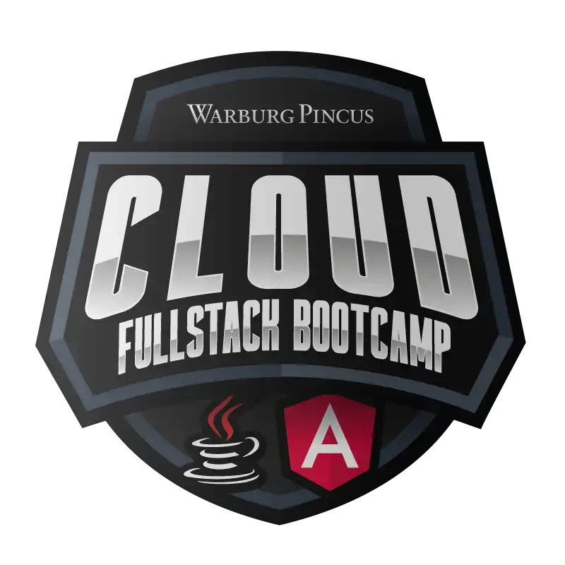

<

BootCamp-Cloud-Fullstack-Warburg-Pincus
Bootcamp - Warburg Pincus, com 151 horas de experiência educacionais que abrangem as principais tecnologias para se tornar um(a) profissional Fullstack. Ao gerar a sua certificação, o seu perfil terá visibilidade para 6 grandes empresas, são elas: Warburg Pincus, Sólides, TakeBlip, Eleva Educação, Superlógica, Americanet e Blu.

  

- Cronograma e Tecnologias: Gestão de Projetos, JavaScript, Framework Angular, Linguagem Java, Banco de Dados SQL e NoSQL, Spring FramewOrk, Cloud Computer AWS.

- 43 cursos.

- 6 desafios de projeto.

- 10 desafios de código.

- 1 live.

- 12 Mentorias.

